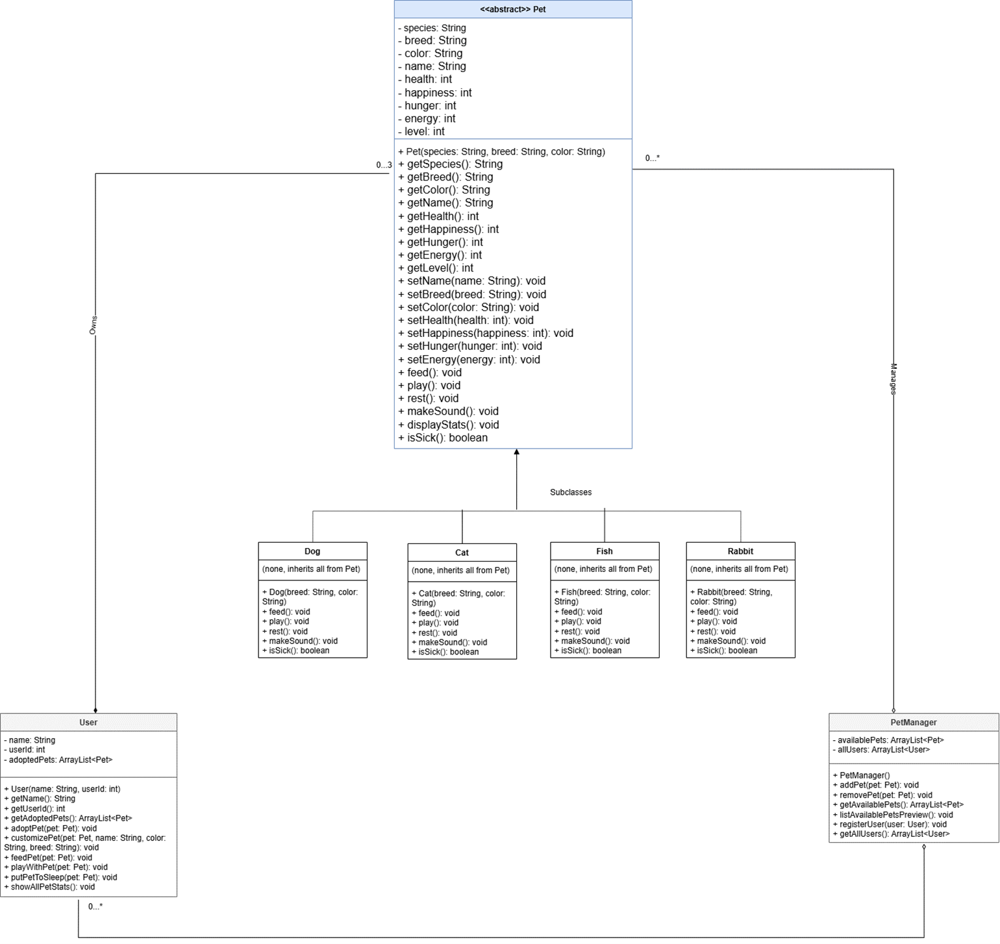
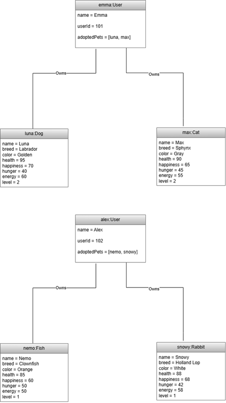
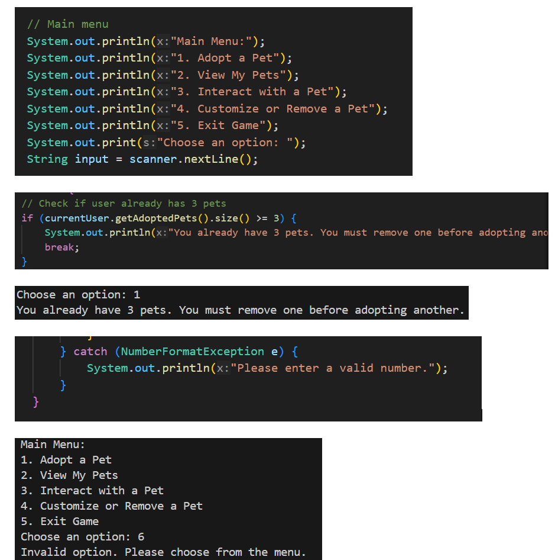
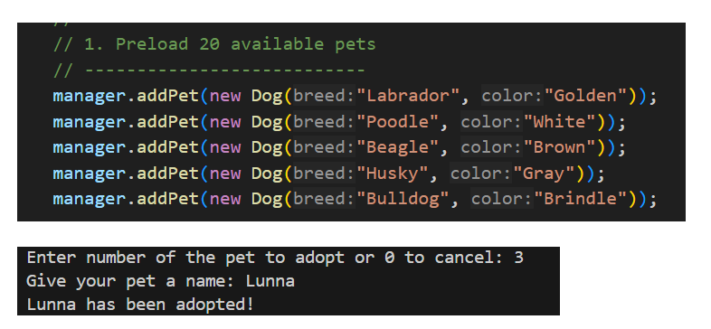
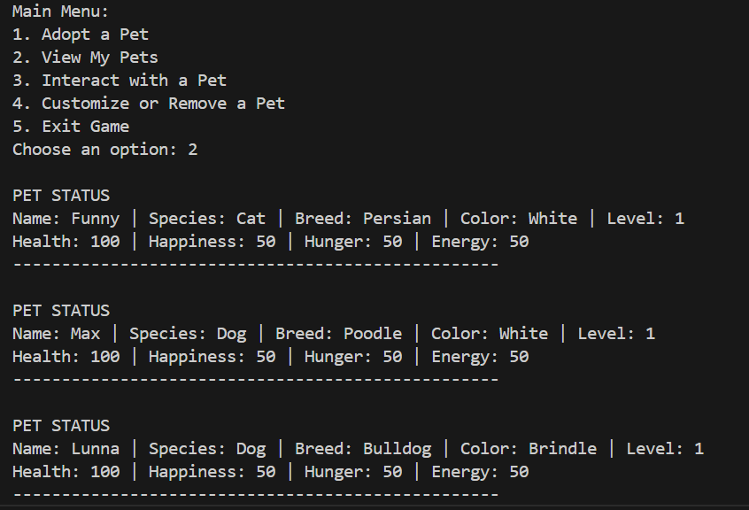
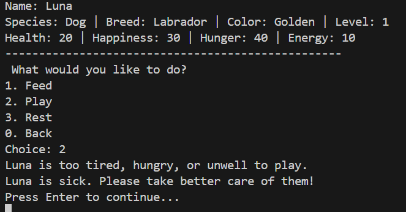

# 🐾 Virtual Pet Management System

> Java Object-Oriented Programming project demonstrating encapsulation, inheritance, polymorphism, abstraction, UML modelling, and multi-user system design.

---

## 📖 Overview

The Virtual Pet Management System is a console-based Java application developed as part of the BSc (Hons) Computing programme.

The application allows multiple users to adopt, manage, and interact with virtual pets while demonstrating the practical application of Object-Oriented Programming principles.

Users can:

- Create and manage pet collections
- Adopt and remove pets
- Feed, play with, and rest pets
- Monitor pet health and happiness
- Progress pet levels through interactions
- Experience pet sickness and lifecycle management
- Interact with different pet species with unique behaviours

The project evolved through multiple development stages, progressively introducing advanced OOP concepts and more complex game functionality.

---

## 🚀 Key Features

### Pet Management

- Create virtual pets
- Adopt pets
- Rename pets
- Remove pets
- View pet statistics

### Multi-User System

- Multiple users supported
- User-specific pet collections
- Ownership management

### Interactive Gameplay

- Feed pets
- Play with pets
- Rest pets
- Gain experience and levels

### Advanced OOP Features

- Inheritance
- Polymorphism
- Encapsulation
- Abstraction
- Method overriding
- Abstract classes

### Health & Lifecycle Management

- Health tracking
- Hunger tracking
- Happiness tracking
- Energy management
- Sick state detection
- Automated pet death handling

---

## 🏗️ Object-Oriented Design

The system was designed using UML modelling before implementation.

### Core Classes

| Class | Purpose |
|---------|---------|
| Pet | Abstract base class containing shared pet behaviour |
| Dog | Dog-specific implementation |
| Cat | Cat-specific implementation |
| Rabbit | Rabbit-specific implementation |
| Fish | Fish-specific implementation |
| User | Manages pet ownership |
| PetManager | Controls application state and interactions |
| Main | Application entry point |

---

## 📊 UML Class Diagram



The UML diagram demonstrates:

- Class hierarchy
- Inheritance relationships
- Encapsulation
- Composition
- System architecture

---

## 🔄 Object Diagram



The object diagram illustrates runtime relationships between users and adopted pets.

---

## 🖥️ Application Screenshots

### Main Menu



---

### Pet Adoption



---

### Pet Management



---

### Sick State Detection



---

## 🛠️ Technologies Used

### Programming

- Java

### Object-Oriented Programming

- Encapsulation
- Inheritance
- Polymorphism
- Abstraction
- Composition

### Design & Documentation

- UML Class Diagrams
- UML Object Diagrams

### Development Tools

- Visual Studio Code
- Java Development Kit (JDK)

---

## 📂 Project Structure

```text
virtual-pet-management-system/
│
├── Main.java
├── Pet.java
├── User.java
├── PetManager.java
├── Dog.java
├── Cat.java
├── Rabbit.java
├── Fish.java
│
├── assets/
│   ├── uml-class-diagram.png
│   ├── object-diagram.png
│   ├── main-menu.png
│   ├── pet-adoption.png
│   ├── pet-management.png
│   └── sick-pet.png
│
└── README.md
```

---

## ▶️ Running the Application

### Requirements

- Java JDK 17+ (or compatible version)

### Compile

```bash
javac *.java
```

### Run

```bash
java Main
```

---

## 🎓 Academic Context

This project was developed during the Object-Oriented Programming module of the BSc (Hons) Computing degree.

The project demonstrates practical implementation of:

- Software design principles
- UML modelling
- Object-Oriented Programming
- Java application development
- System architecture design

---

# 📫 Contact

* **Author:** Inna Bains  
* **Degree:** BSc (Hons) Computing, Arden University (2026)  
* **Email:** [innessyk@gmail.com](mailto:innessyk@gmail.com) 
* **GitHub:** https://github.com/InnaBains
* **LinkedIn:** https://www.linkedin.com/in/inna-bains-0aa890264

---

## 📜 License

This repository is provided for educational and portfolio purposes.
